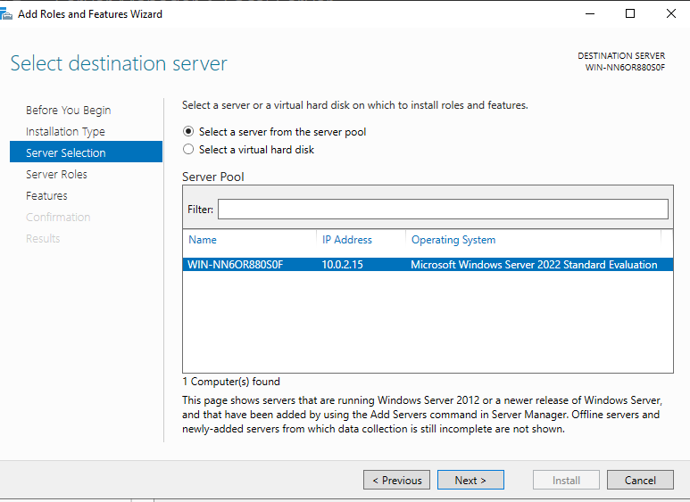
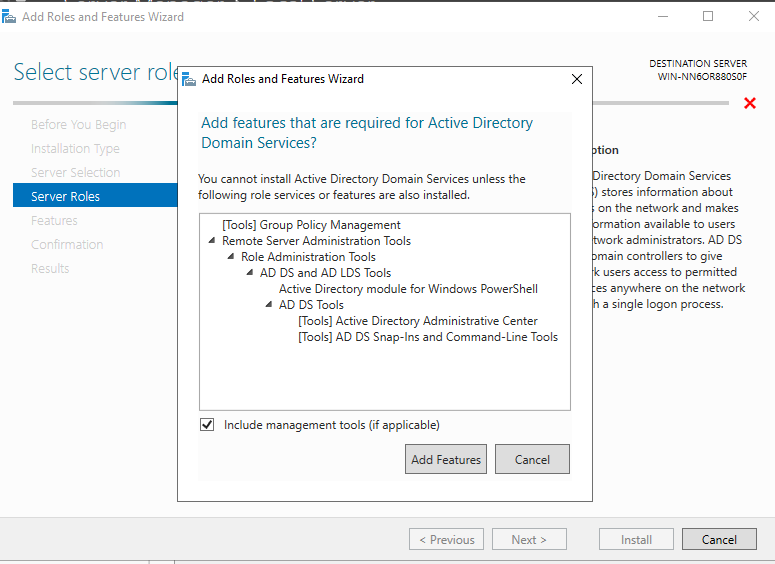
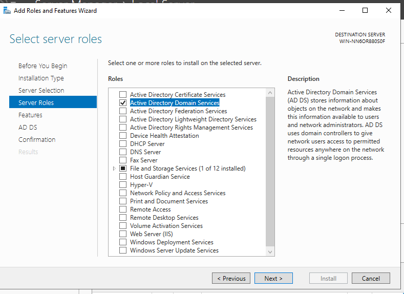
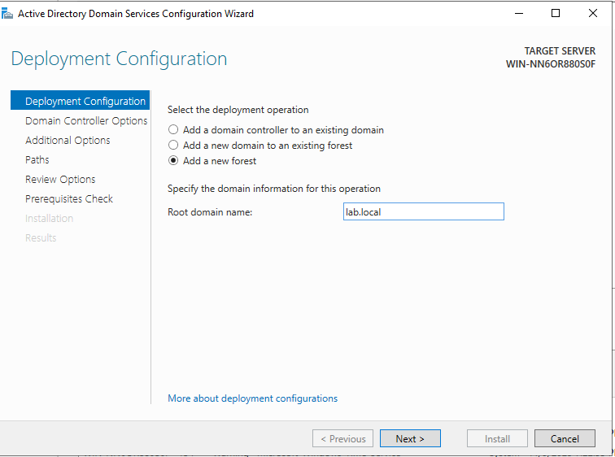
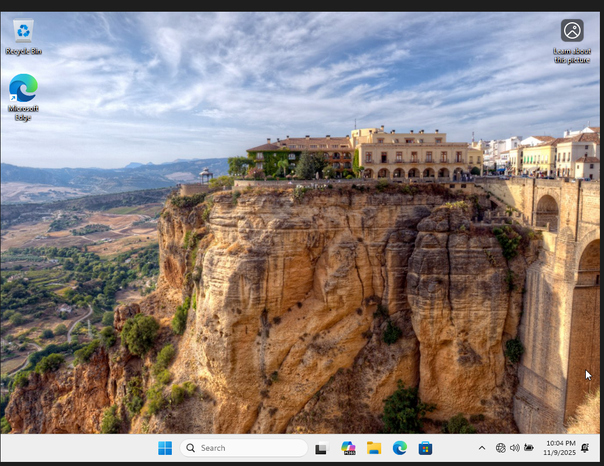
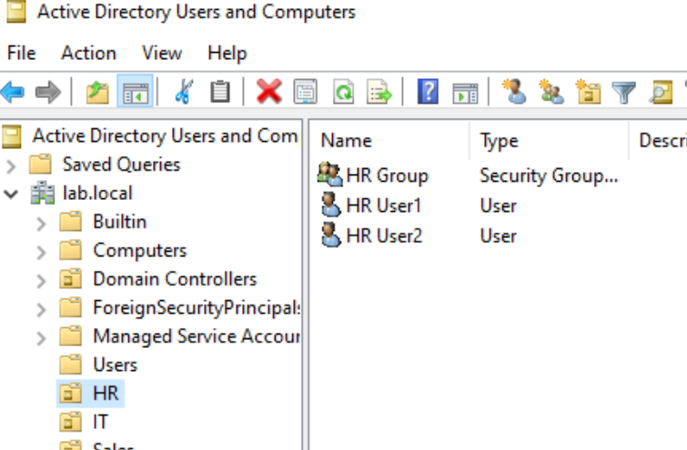
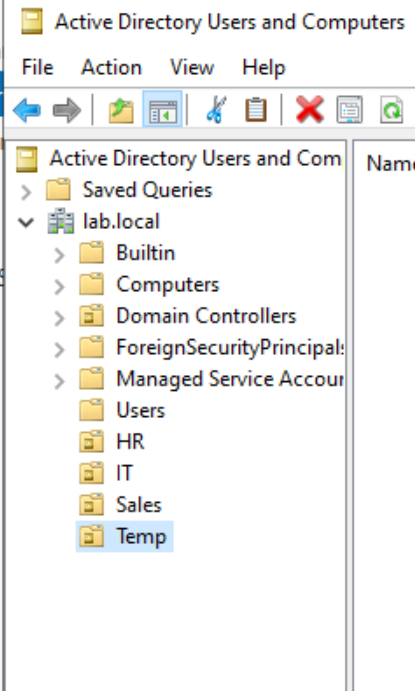
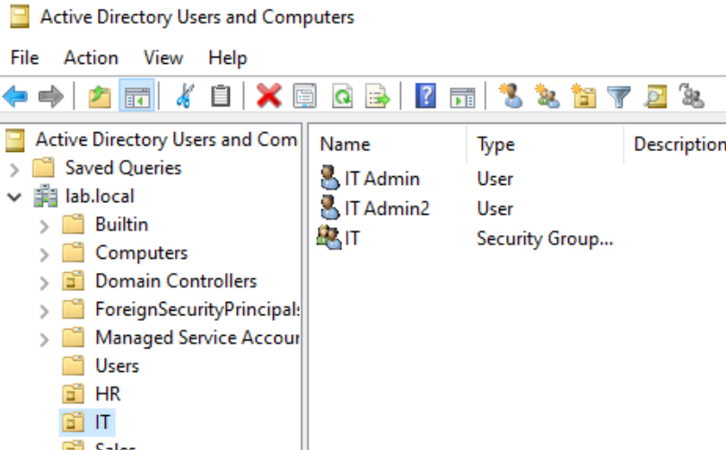
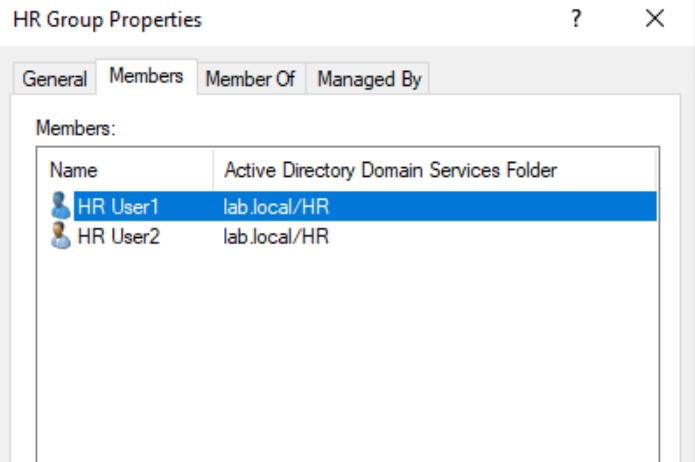

# Lab 1 – Active Directory Domain Controller Deployment (Windows Server 2022)

## 🎯 Overview
This lab demonstrates building a fully functional **Active Directory Domain Services (AD DS)** environment on **Windows Server 2022**. Tasks completed in this lab include:

- Installing the AD DS server role  
- Promoting the server to a Domain Controller  
- Configuring DNS automatically with AD  
- Creating Organizational Units (OUs)  
- Creating users & security groups  
- Assigning users to groups  
- Designing a clean AD structure for future labs  

Domain created: **lab.local**

---

# 🖥️ Step 1 — Install AD DS

### 📌 Server Selection  
Selecting the local server for AD DS installation.

### 📌 Choose Active Directory Domain Services
The AD DS role is added from Server Manager.

### 📌 Add Required Features
Windows automatically adds needed features (GPMC, RSAT tools).

---

# 🏰 Step 2 — Promote Server to Domain Controller

### 📌 Create a New Forest (lab.local)

### 📌 Domain Controller Options  
Configuring DNS, Global Catalog, and DSRM password.

### 📌 Prerequisite Check  
All checks passed — server is ready to be promoted.

---

# 🗂️ Step 3 — Create Organizational Units

OUs created for department separation:

- **HR**
- **IT**
- **Sales**
- **Temp**

---

# 👥 Step 4 — Create Security Groups & Users

### 📌 HR Department  
Created:
- HR Group  
- HR User1  
- HR User2  

  

---

### 📌 IT Department  
Created:
- IT Group  
- IT Admin  
- IT Admin2  

---

# 🔐 Step 5 — Verify Group Membership
Example: HR Group members include HR User1 and HR User2.

---

# ✅ **Lab 1 Complete**

This lab demonstrates the foundational skills required for:
- IT Support  
- Help Desk  
- Junior SysAdmin  
- IT Operations  

The domain created in this lab will be used throughout future labs (DNS, DHCP, GPO, VPN, Cloud Identity, etc.).

---
