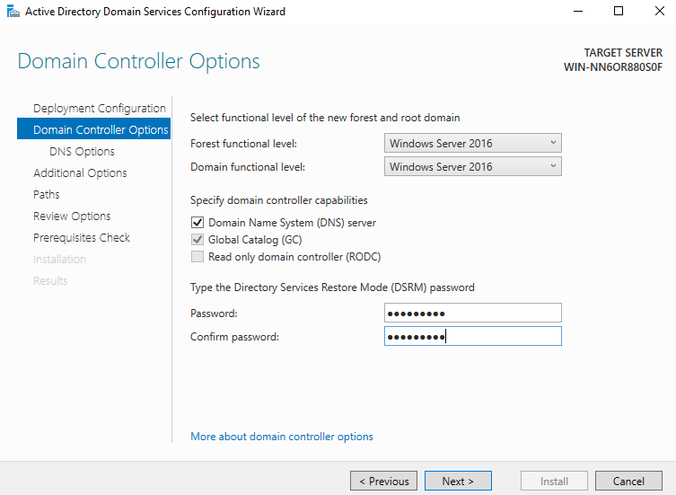
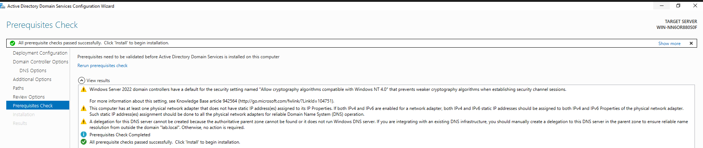

# Lab 1 – Active Directory Domain Deployment

**Goal:** Build a fully functional Windows Server 2022 domain controller, configure DNS, create organizational units, and set up users and security groups under the new domain `lab.local`.

---

## 📂 Environment

- **Server OS:** Windows Server 2022 Standard (Evaluation)  
- **Domain:** `lab.local`  
- **Tools:** Server Manager, AD DS Configuration Wizard, ADUC  
- **Folder Structure:**  
  Lab1-WindowsServer_AD/  
  ├── README.md  
  ├── Lab1-WindowsServer_AD.pdf  
  └── images/

---

## 🏗 Step 1 – Install Active Directory Domain Services (AD DS)

Open **Server Manager → Add Roles and Features**.

Screenshots:

  
  

---

## 🏗 Step 2 – Promote Server to Domain Controller

Configure new forest: `lab.local`

Set DSRM password and DNS/GC settings:

Run prerequisites – confirm success:

---

## 🧩 Step 3 – Build Organizational Unit (OU) Structure

Created the following OUs:

- **HR**
- **IT**
- **Sales**
- **Temp**

Screenshot:

Alternate view:

---

## 👥 Step 4 – Create Security Groups

- **HR Group** → for HR department users  
- **IT Group** → for IT admins  

Screenshot:

---

## 🧑‍💼 Step 5 – Create Users & Assign to Groups

Users created per department:

- HR: `HR User1`, `HR User2`  
- IT: `IT Admin`, `IT Admin2`

Screenshots:

---

## ✔ Verification

- Domain `lab.local` successfully deployed  
- DNS configured automatically during promotion  
- All OUs created  
- Groups created properly  
- Users assigned correctly to each OU  
- Group membership validated  

---

## 📄 Full Lab Report

Download the full PDF walkthrough:

👉 [Lab1-WindowsServer_AD.pdf](Lab1-WindowsServer_AD.pdf)

---

## 🧠 Skills Demonstrated

- AD DS installation  
- DNS configuration  
- Domain controller promotion  
- OU planning & structure  
- User account management  
- Group membership & access control  
