# Lab 2 – Windows 10 Domain Client, DNS, and Remote Desktop

**Server VM:** `Server-2022-DC-Portfolio`  
**Client VM:** `Win10-Client`  
**Domain:** `lab.local`

This lab builds on **Lab 1**, where your Server 2022 VM was promoted to a domain controller.  
In this lab, you:

- Build a Windows 10 client VM  
- Join it to the `lab.local` domain  
- Point the client’s DNS to the domain controller  
- Validate DNS using ping and nslookup  
- Enable Remote Desktop  
- Connect to the client from the server  

All screenshots for this lab are stored in:  
`Lab2-Win10-DomainJoin/Images`

---

## 1. Create the Windows 10 Client VM

1. Create a new VM in VirtualBox named **Win10-Client**  
   - 4 GB RAM  
   - 50 GB disk  
   - Attach Windows 10 ISO

2. Start the VM and go through Windows Setup:

   

3. Log in as the local admin and confirm the desktop loads:

   

4. Confirm the VirtualBox storage layout:

   

---

## 2. Verify Server and Client Network Settings

### Server IP (Server-2022-DC-Portfolio)

Run the following:

ipconfig

Expected (your screenshot):

- IPv4: **10.0.0.124**  
- Gateway: **10.0.0.1**

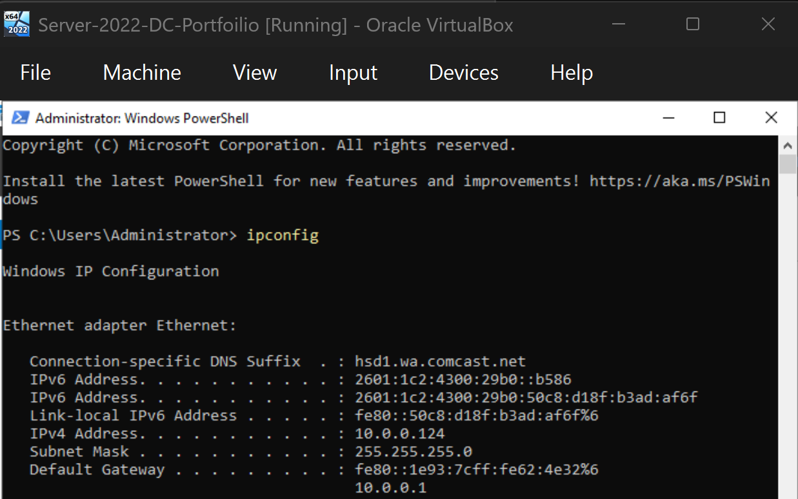

---

### Client IP (Win10-Client)

Run:

ipconfig

Expected (your screenshot):

- IPv4: **10.0.0.52**  
- Gateway: **10.0.0.1**

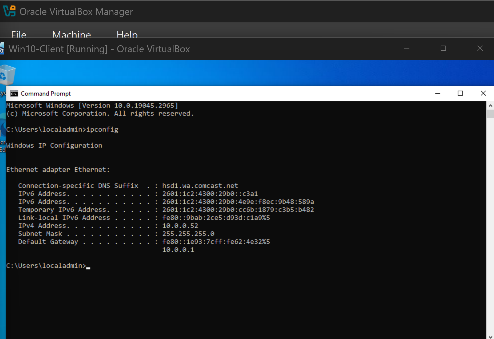

---

### Test Ping to Domain Controller

Run:

ping 10.0.0.124

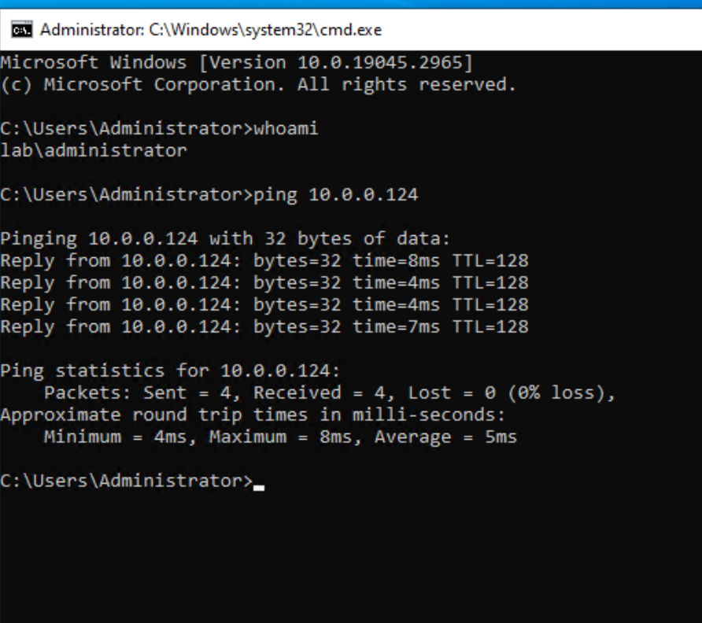

Success = **reply with 0% loss**.

---

## 3. Configure DNS and Join the Domain

### Set DNS to the Domain Controller

1. Open:  
   Control Panel → Network and Internet → Network and Sharing Center  
   → Change adapter settings  
   → Ethernet → Properties → IPv4 → Properties

2. Set:

- Obtain IP automatically  
- Use the following DNS server: **10.0.0.124**

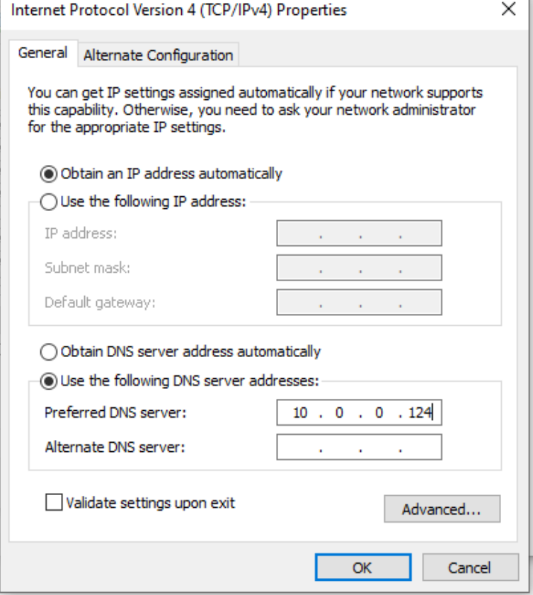

---

### Flush DNS

ipconfig/flushdns

---

### Test DNS Resolution

nslookup lab.local

Expected output:

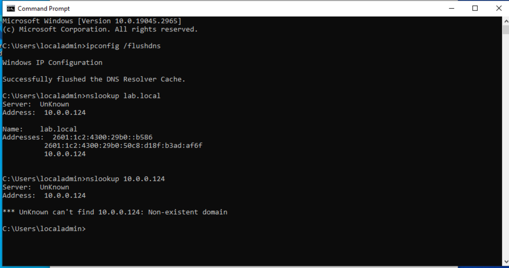

---

### Join the Domain

Open:

- This PC → Properties  
- Change settings  
- Change (computer name)  
- Member of: **Domain**  
- Enter: **lab.local**

You will be prompted for domain credentials:

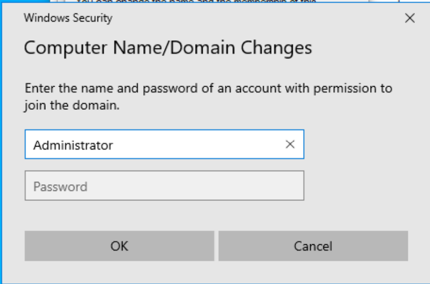

When successful:

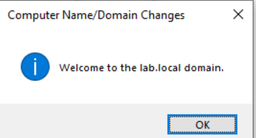

Restart when prompted.

---

### Log Into the Domain

At login screen choose **Other user**, then sign in as:

LAB/Administrator

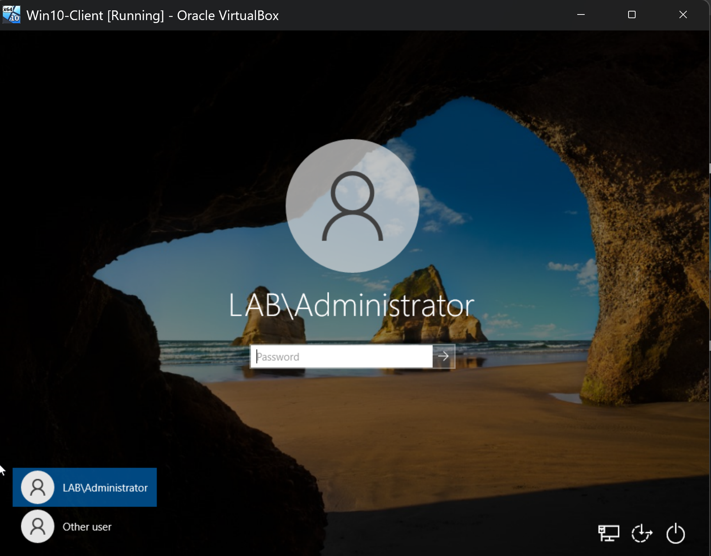

Once logged in:

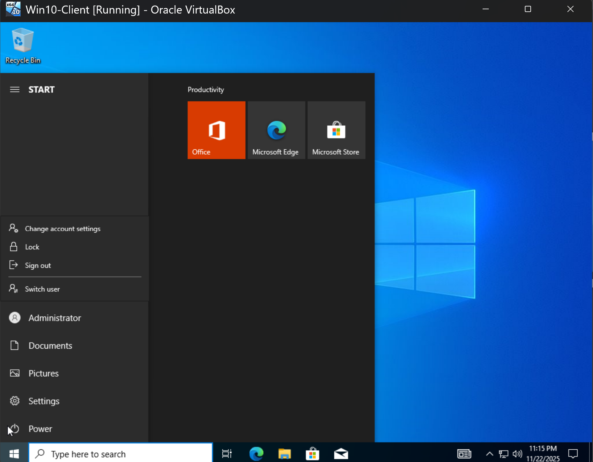

Test a normal user:

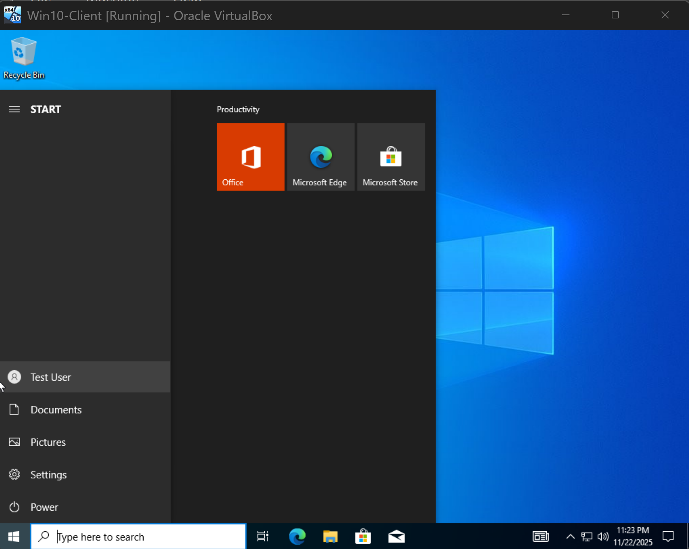

---

## 4. Enable Remote Desktop on Client

1. Go to:  
   Settings → System → Remote Desktop  
   Enable Remote Desktop

2. Add allowed user:

LAB/testuser

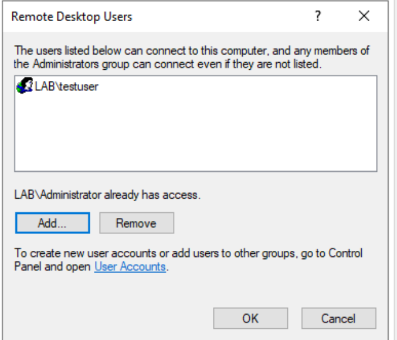

---

## 5. Test RDP from the Server

### Open RDP Client

Press:

Win + R → mstsc

Enter the client IP:

10.0.0.52

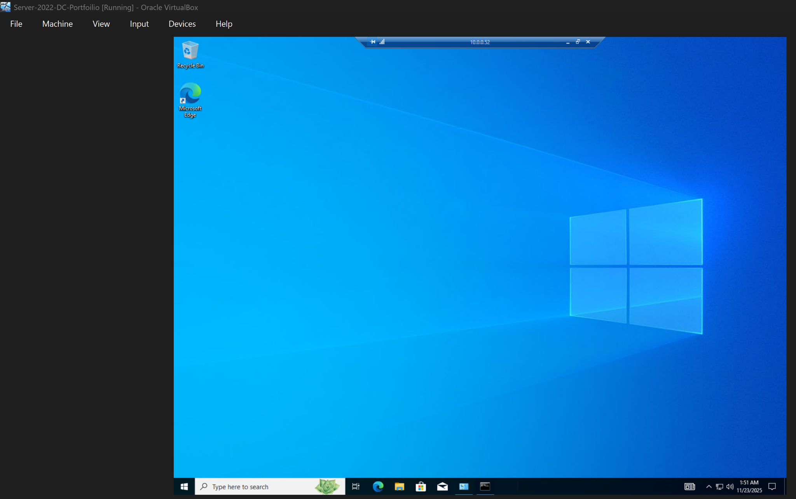

---

### Enter Credentials

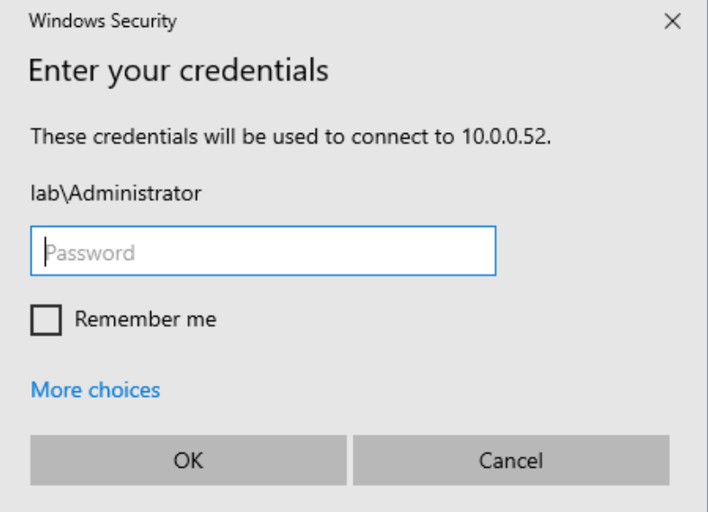

---

### Approve Connection on Client

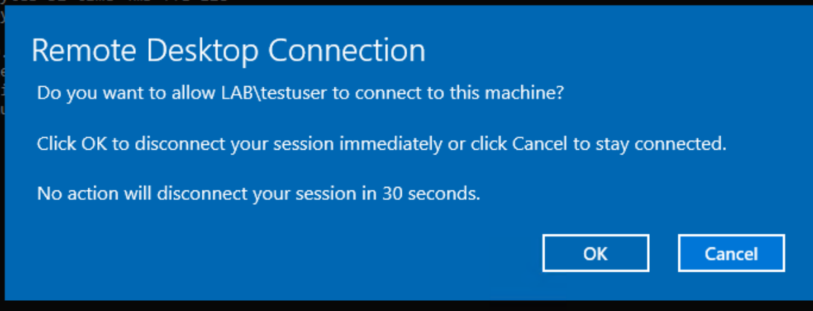

---

### Successful RDP Session

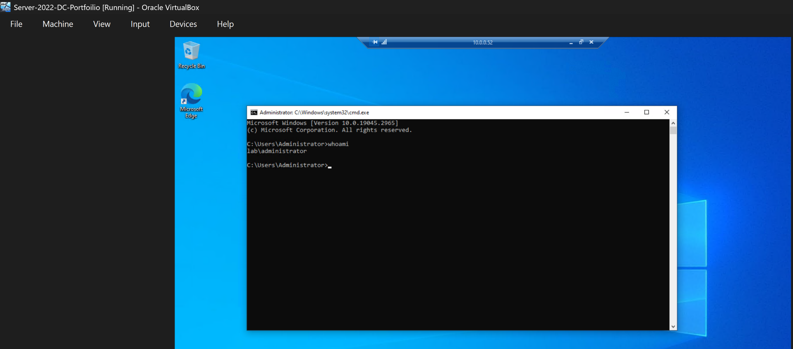

Run inside RDP:
whoami

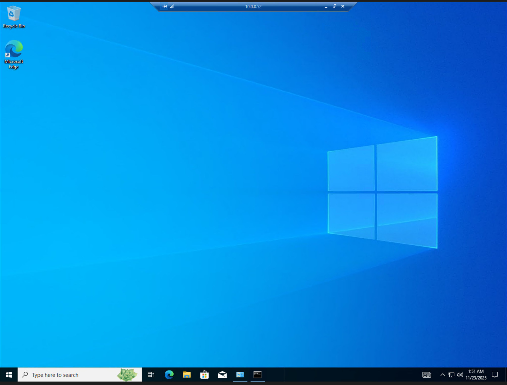

---

## 6. Skills Demonstrated

- Windows 10 installation  
- Active Directory domain join  
- DNS troubleshooting (`nslookup`, `ping`)  
- Remote Desktop configuration  
- Domain authentication  
- Multi-VM networking  
- Basic sysadmin operations  

---

📄 **Full Lab Report (PDF):**  
[Download Lab 2 Report](./Lab2-Win10-Client-DomainJoin-DNS-RDP.pdf)

