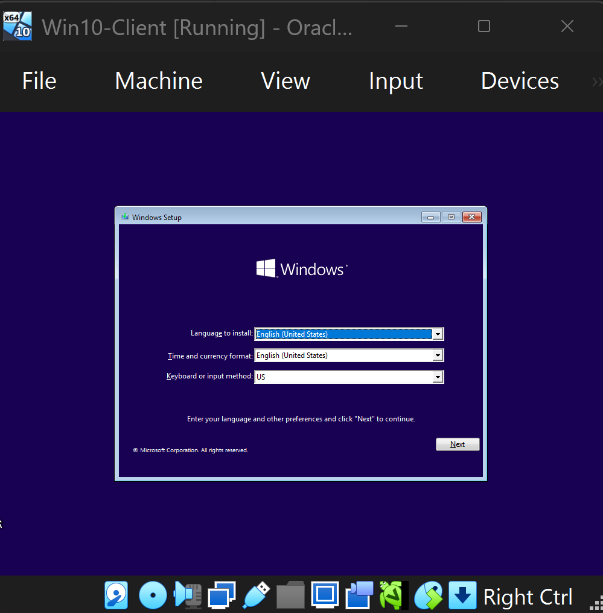
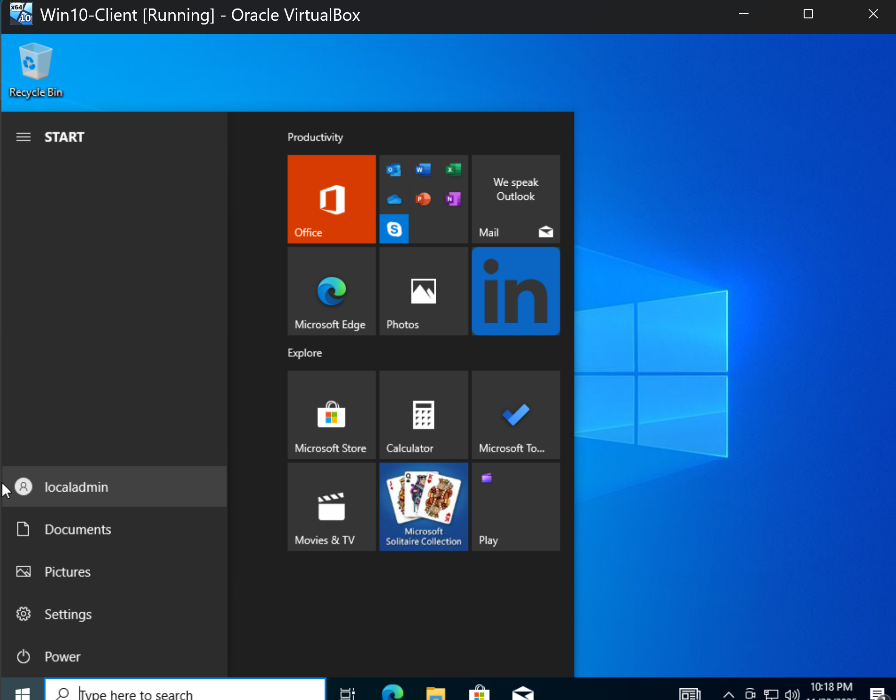
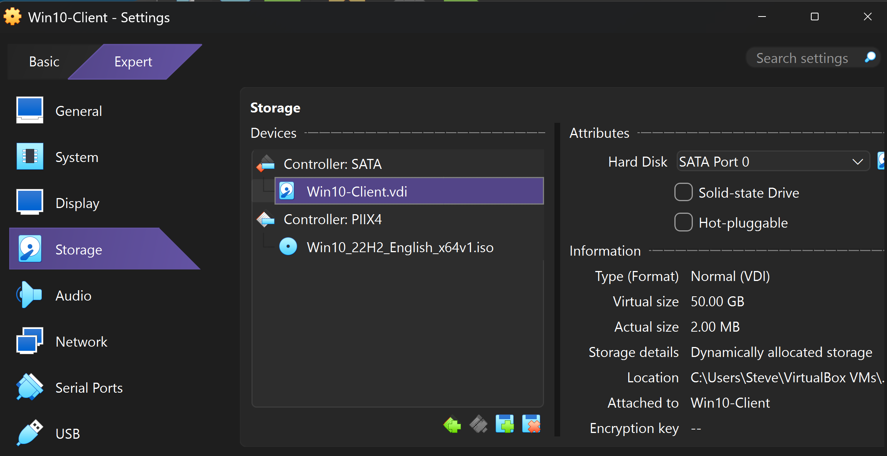

# Lab 2 – Windows 10 Domain Client, DNS, and Remote Desktop

**Server VM:** `Server-2022-DC-Portfolio`  
**Client VM:** `Win10-Client`  
**Domain:** `lab.local`

This lab builds on **Lab 1**. You already have a Windows Server 2022 domain controller at `10.0.0.124`.  
In this lab you:

- Build a Windows 10 client VM  
- Join it to the `lab.local` domain  
- Point the client DNS to the domain controller  
- Verify name resolution and connectivity  
- Enable Remote Desktop and test an RDP session

All screenshots for this lab are stored in:  
`Lab2-Win10-DomainJoin/Images`

---

## 1. Create the Windows 10 Client VM

1. In **VirtualBox**, create a new VM named **Win10-Client** (50 GB disk, 4 GB RAM).
2. Attach the Windows 10 ISO to the VM.

   

3. Install Windows 10 with default options.
4. After installation, sign in with the **localadmin** account and verify the desktop loads.

   

5. Confirm the virtual disk layout looks correct in VirtualBox.

   

---

## 2. Verify Server and Client Network Settings

Before joining the domain, confirm both machines are on the same network and that the server has a stable IP.

1. On the **Server 2022** VM, run:

   ```powershell
   ipconfig
   Expected:

IPv4 Address: 10.0.0.124

Default Gateway: 10.0.0.1

On the Win10-Client, open Command Prompt:
ipconfig


Expected:

IPv4 Address: 10.0.0.52

Default Gateway: 10.0.0.1

Test connectivity (client → server):
ping 10.0.0.124


You should receive 4 replies, 0% loss.

🔹 3. Configure DNS & Join the Domain
1. Open Network Adapter Settings:

Control Panel → Network and Internet → Network and Sharing Center → Change adapter settings

Right-click Ethernet → Properties → IPv4 → Properties

Set:

Obtain an IP automatically

DNS server: 10.0.0.124

2. Flush DNS cache:
ipconfig /flushdns

3. Test domain DNS resolution:
nslookup lab.local


Expected:

DNS Server: 10.0.0.124

Name: lab.local

4. Join the domain:

Open:

System Properties → Change settings → Change → Member of: Domain

Enter:

lab.local


When prompted, provide:

Username: LAB\Administrator

Password: your domain admin password

5. Successful domain join:

Restart the machine.

6. Log into the domain

On the login screen choose Other user and enter:

Username: LAB\Administrator

Once logged in:

7. Test login with standard user

Example: LAB\testuser

🔹 4. Enable Remote Desktop on the Client

On the Win10-Client:

Settings → System → Remote Desktop → Enable

Add allowed users:

Click Select users → Add:

LAB\testuser


🔹 5. Test RDP from the Server
1. On the Server 2022 VM:

Press:

Win + R → mstsc


Enter:

10.0.0.52


2. Enter domain credentials:

3. Approve the connection on the client:

4. Successful remote desktop session:

5. Verify user context:
whoami


🔹 6. Skills Demonstrated

Windows 10 installation & configuration

DNS configuration for domain clients

Domain join troubleshooting

ICMP & DNS testing (ping, nslookup)

RDP configuration & remote administration

Domain user authentication

Basic sysadmin workflow in a multi-VM environment
