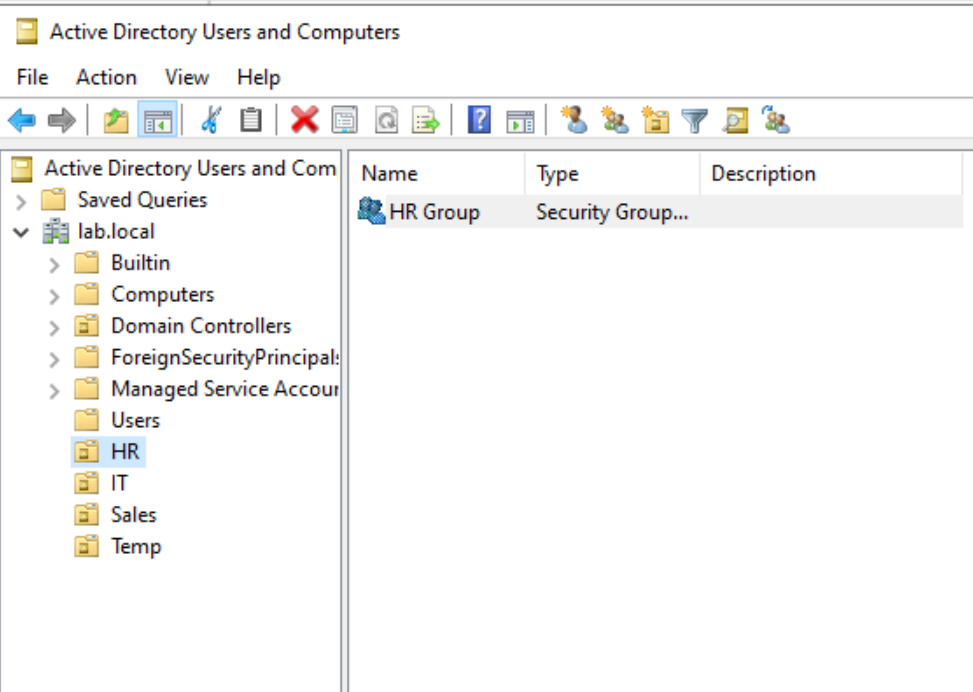

# Steven Nielsen – IT Homelab Portfolio

Welcome! This repository contains hands-on labs that mirror real-world IT support and junior system administration work. Each lab includes:

- A **step-by-step walkthrough**
- **Screenshots** of key configuration steps
- A **multi-page PDF report** you can download
- Clear mapping to skills relevant for **IT Support, Service Desk, and Junior SysAdmin** roles

---

## 🧪 Labs

### 🔹 [Lab 1 – Active Directory Domain Deployment](lab1/README.md)

**Focus:** Windows Server 2022, AD DS, OU design, user and group management  
**Highlights:**

- Installed and configured **Active Directory Domain Services**
- Promoted a server to a **domain controller** for `lab.local`
- Designed department-based **OU structure** (HR, IT, Sales, Temp)
- Created **security groups** and **user accounts** with proper membership

Preview:

> See the full write-up here: [Lab 1 README](lab1/README.md)  
> Download the report: [lab1-report.pdf](lab1/lab1-report.pdf)

---

## 🚧 Upcoming Labs

Planned labs that will be added to this portfolio:

- **Lab 2 – Windows 10/11 Client Domain Join & GPO Basics**
- **Lab 3 – DHCP & DNS Configuration for a Small Network**
- **Lab 4 – File Server with NTFS & Share Permissions**
- **Lab 5 – Basic PowerShell Automation for User Management**
- **Lab 6 – Ticket-Driven Troubleshooting Scenarios**

Each future lab will follow the same structure as Lab 1: README, screenshots, and a PDF report.

---

## 🔧 Tech Stack & Tools

- Windows Server 2022 (Evaluation)
- Windows 10/11 client VMs
- Active Directory Domain Services (AD DS)
- DNS, basic DHCP (future labs)
- PowerShell (future labs)
- Virtualization via VirtualBox / Hyper-V

---

## 📫 Contact

If you’d like to talk about **IT Support** or **Junior SysAdmin** opportunities in the Vancouver, WA / Portland, OR area:

- **LinkedIn:** (add your profile link here)  
- **Email:** steven.nielsen226@gmail.com
